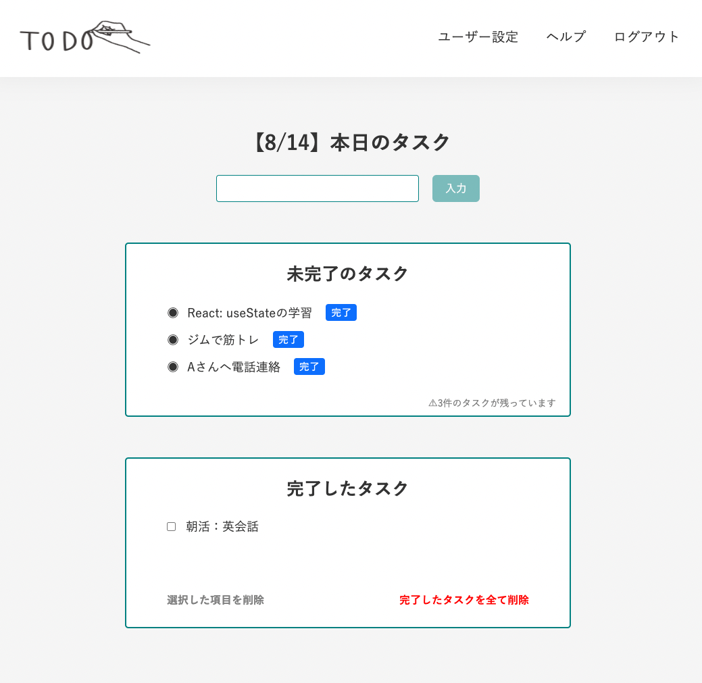

# ReactでToDoアプリの制作🧑‍💻
React学習中で、アウトプットのためにToDoアプリを制作しました。

## 使用技術
- react ^18.2.0
- typescript ^4.7.4
- emotion  ^11.10.0
- react-router-dom ^6.3.0
- react-toastify ^9.0.8
- axios ^0.27.2
- react-helmet-async ^1.3.0
- recoil ^0.7.5
- reactjs-popup ^2.0.5

## 機能
- ログイン機能
- jsonplaceholerよりAPI取得
- Todoタスク追加・削除

**アプリイメージ🙌**

## 作業期間
2日程度

## 開発者
[わでぃん](https://github.com/wadeen)

<!-- ### `npm start` -->

